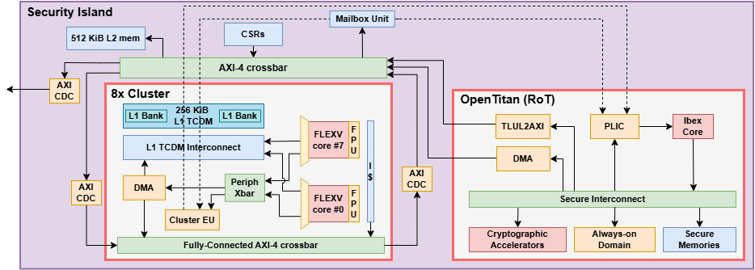
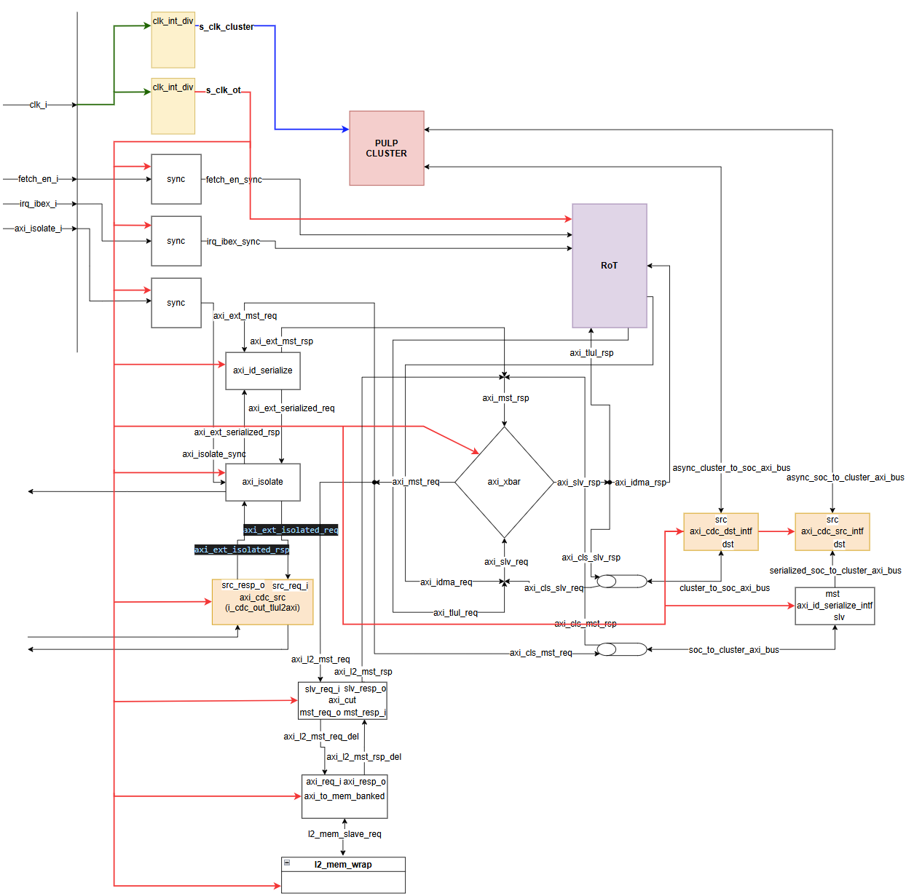

# Architecture

As shown in the block diagram above, *Security Island* comprises these components:

- **[Root-of-Trust (OpenTitan)](https://opentitan.org/book/doc/introduction.html)**

    The security island is based on the [OpenTitan project](https://opentitan.org/book/doc/introduction.html), which serves as the Hardware Root-of-Trust (HWRoT) of the platform. It handles *secure boot* and system integrity monitoring fully in HW through cryptographic acceleration services.

    Compared to OpenTitan (Top Earlgrey), this RoT is modified/configured as follows:

    * 1 AXI4 manager interface to SCAR-V, with a bridge between AXI4 and TileLink Uncached Lightweight
    (TL-UL) internally used by OpenTitan. By only exposing a manager port, unwanted access to the
    security island is prevented.

    * Embedded flash memory replaced with an SRAM preloaded before secure boot procedure from an
    external SPI flash through OpenTitan private SPI peripheral. Once preload is over, the OpenTitan
    secure boot framework is unchanged compared to the vanilla version.

    * a *boot manager* module has been designed and integrated to manage the [two available
    bootmodes](./sw.md). In **Secure** mode, the system executes the secure boot framework as soon as
    the reset is asserted, loading code from the external SPI and performing the signature check on
    its content. Otherwise, in **Non-secure** mode, the *security island* is clock gated and must be
    clocked and woken-up by an external entity (e.g., *host domain*)

    By default, the security island hosts 512 KiB of main SPM, and 16 KiB of OTP memory, user-configurable.

- **[Accelerator Cluster (PMCA)](https://github.com/pulp-platform/pulp_cluster/tree/yt/rapidrecovery)**

    To augment computational capabilities, the security island incorporates one PMCA, described below. This PMCA
    integrates a DMA engine to independently fetch data from the on-chip SPM or external DRAM.

    The [hybrid modular redundancy (HMR) *PMCA*](https://arxiv.org/abs/2303.08706) is
    specialized in accelerating the inference of Deep Learning and Machine Learning models. The
    multicore accelerator is built around 8 32-bit RISC-V cores empowered with ISA extensions, enabling
    integer arithmetic from 32-bit down to 2-bit precision.

    The PMCA integrates an FPU co-processor for each core to support multi-format floating-point operations.

    The PMCA embeds the fault-tolerant [Safe-NEureka](https://arxiv.org/abs/2602.04803) Neural Engine to accelerate convolutional neural networks.

    The PMCA's general-purpose cores can be reconfigured for *redundant execution*.
    A [Hybrid Modular Redundancy (HMR)](https://doi.org/10.1145/3635161) unit allows the
    split/lock of the available cores in different redundant configurations during runtime, trading off
    the computing performance and the fault resilience capability according to the criticality of the
    application.

    The PMCA can be configured in multiple redundant modes:

    * **Independent:** All cores act independently with no redundancy mechanism. This configuration allows
    higher performance but has no reliability.

    * **Dual Modular Redundancy (DMR)**: The cores are grouped in lock-stepped pairs and rely on a
    specialized hardware extension for fast fault recovery in less than 30 clock cycles in case of
    fault detection. The PMCA provides the best trade-off between performance and fault recovery in
    this configuration.

    * **Triple Modular Redundancy (TMR)**: The cores are grouped in lock-stepped triplets and rely on
    either hardware extension or software mechanisms to recover from incurring faults. The PMCA
    provides the highest fault resilience in this configuration, at the cost of reduced performance.

    By default, the PMCA's processing elements and tensor accelerator share access to 256 KiB of
    L1 SPM (TCDM).

- **L2 Memory**

    a 512 KiB L2 memory used to .... (TODO)

- **[Mailbox unit](https://github.com/pulp-platform/mailbox_unit)**

    Main communication vehicle between cluster and RoT, based on an interrupt notification mechanism

    | **Offset** | **Register**     | **Width (bit)** | **Note**           |
    |------------|------------------|-----------------|--------------------|
    | `0x00`     | `INT_SND_STAT`   | `1`             | current irq status |
    | `0x04`     | `INT_SND_SET `   | `1`             | set irq            |
    | `0x08`     | `INT_SND_CLR `   | `1`             | clear irq          |
    | `0x0C`     | `INT_SND_EN  `   | `1`             | enable irq         |
    | `0x40`     | `INT_RCV_STAT`   | `1`             | current irq status |
    | `0x44`     | `INT_RCV_SET `   | `1`             | set irq            |
    | `0x48`     | `INT_RCV_CLR `   | `1`             | clear irq          |
    | `0x4C`     | `INT_RCV_EN  `   | `1`             | enable irq         |
    | `0x80`     | `LETTER0       ` | `32`            | message            |
    | `0x8C`     | `LETTER1       ` | `32`            | message            |

    The above register map can be found in the dedicated
    [repository](https://github.com/pulp-platform/mailbox_unit) and is reported here for convenience.

- **Configuration & Status Registers (CSRs)**

   These are configuration registers for the clock dividers and status registers for the cluster execution (Fetch Enable and EOC)

    | **Name**                         | **Offset** | **Length** | **Description**                                                        |
    |:---------------------------------|:-----------|-----------:|:-----------------------------------------------------------------------|
    | `PULP_CLUSTER_FETCH_EN`          | `0x0`      |        `4` | Pulp Cluster Fetch Enable                                              |
    | `PULP_CLUSTER_EOC`               | `0x4`      |        `4` | Pulp Cluster Fetch EOC                                                 |
    | `CL_CLK_EN`                      | `0x8`      |        `4` | Pulp Cluster clk gate enable                                           |
    | `CL_CLK_DIV_VALUE`               | `0xc`      |        `4` | Pulp Cluster clk divider value                                         |
    | `OT_CLK_DIV_VALUE`               | `0x10`     |        `4` | Opentitan clk divider value                                            |

## Clock and reset

The Security Island has a single input clock which enters into 2 separated configurable clock dividers for RoT and Cluster, as shown in the image below.

## Memory Map

| **Start Address**        | **End Address (excl.)** | **Length**       | **Size** | **Permissions** | **Cacheable** | **Atomics** | **Region**   | **Device**                                                           |
|--------------------------|-------------------------|------------------|----------|-----------------|---------------|-------------|--------------|----------------------------------------------------------------------|
| **External**             |                         |                  |          |                 |               |             |              |                                                                      |
| `0x0001_0000 `           | `0x9FFF_FFFF`           | `0x9FFF_0000`    |          | rw              |               |             |              | AXI EXT PORT (TLUL2AXI)                                              |
| **Internal**             |                         |                  |          |                 |               |             |              |                                                                      |
| `0x0000_0000`            |                         |                  | 256 KiB  | (debug)         |               |             | Debug        | Debug ROM                                                            |
| `0xa000_0000 `           |                         |                  | 512 KiB  | rw              |               |             |              | L2 MEM                                                               |
| `0xb000_0000 `           |                         |                  |          | rw              |               |             |              | CLUSTER                                                              |
| **Cluster PERIPHs**                                                                                                                                                                                                    |
|  TBD |
| `0xbf00_0000 `           |                         |                  |          | rw              |               |             |              | CSR regs                                                             |
| `0xc000_0000`            |                         | `0x40_0000`      |          | rw              |               |             |              | OpenTitan PERIPHs                                                    |
| **OpenTitan PERIPHs**                                                                                                                                                                                                  |
| `0xc000_0000`            |                         |                  |          |                 |               |             |              | UART0                                                                |
| `0xc001_0000`            |                         |                  |          |                 |               |             |              | UART1                                                                |
| `0xc002_0000`            |                         |                  |          |                 |               |             |              | UART2                                                                |
| `0xc003_0000`            |                         |                  |          |                 |               |             |              | UART3                                                                |
| `0xc004_0000`            |                         |                  |          |                 |               |             |              | GPIO                                                                 |
| `0xc005_0000`            |                         |                  |          |                 |               |             |              | SPI_DEVICE                                                           |
| `0xc008_0000`            |                         |                  |          |                 |               |             |              | I2C0                                                                 |
| `0xc009_0000`            |                         |                  |          |                 |               |             |              | I2C1                                                                 |
| `0xc00a_0000`            |                         |                  |          |                 |               |             |              | I2C2                                                                 |
| `0xc00e_0000`            |                         |                  |          |                 |               |             |              | PATTGEN                                                              |
| `0xc010_0000`            |                         |                  |          |                 |               |             |              | RV_TIMER                                                             |
| `0xc013_0000`            |                         |                  |          |                 |               |             |              | OTP_CTRL__CORE                                                       |
| `0xc013_2000`            |                         |                  |          |                 |               |             |              | OTP_CTRL__PRIM                                                       |
| `0xc014_0000`            |                         |                  |          |                 |               |             |              | LC_CTRL                                                              |
| `0xc015_0000`            |                         |                  |          |                 |               |             |              | ALERT_HANDLER                                                        |
| `0xc030_0000`            |                         |                  |          |                 |               |             |              | SPI_HOST0                                                            |
| `0xc031_0000`            |                         |                  |          |                 |               |             |              | SPI_HOST1                                                            |
| `0xc032_0000`            |                         |                  |          |                 |               |             |              | USBDEV                                                               |
| `0xc040_0000`            |                         |                  |          |                 |               |             |              | PWRMGR_AON                                                           |
| **OpenTitan**                                                                                                                                                                                                          |
| `0xc041_0000`            |                         |                  |          |                 |               |             |              | RSTMGR_AON                                                           |
| `0xc042_0000`            |                         |                  |          |                 |               |             |              | CLKMGR_AON                                                           |
| `0xc043_0000`            |                         |                  |          |                 |               |             |              | SYSRST_CTRL_AON                                                      |
| `0xc044_0000`            |                         |                  |          |                 |               |             |              | ADC_CTRL_AON                                                         |
| `0xc045_0000`            |                         |                  |          |                 |               |             |              | PWM_AON                                                              |
| `0xc046_0000`            |                         |                  |          |                 |               |             |              | PINMUX_AON                                                           |
| `0xc047_0000`            |                         |                  |          |                 |               |             |              | AON_TIMER_AON                                                        |
| `0xc048_0000`            |                         |                  |          |                 |               |             |              | AST                                                                  |
| `0xc049_0000`            |                         |                  |          |                 |               |             |              | SENSOR_CTRL                                                          |
| `0xc050_0000`            |                         |                  |          |                 |               |             |              | SRAM_CTRL_RET_AON__REGS                                              |
| `0xc060_0000`            |                         |                  |          |                 |               |             |              | SRAM_CTRL_RET_AON__RAM                                               |
| `0xc100_0000`            |                         |                  |          |                 |               |             |              | FLASH_CTRL__CORE                                                     |
| `0xc100_8000`            |                         |                  |          |                 |               |             |              | FLASH_CTRL__PRIM                                                     |
| `0xc110_0000`            |                         |                  |          |                 |               |             |              | AES                                                                  |
| `0xc111_0000`            |                         |                  |          |                 |               |             |              | HMAC                                                                 |
| `0xc112_0000`            |                         |                  |          |                 |               |             |              | KMAC                                                                 |
| `0xc113_0000`            |                         |                  |          |                 |               |             |              | OTBN                                                                 |
| `0xc114_0000`            |                         |                  |          |                 |               |             |              | KEYMGR                                                               |
| `0xc115_0000`            |                         |                  |          |                 |               |             |              | CSRNG                                                                |
| `0xc116_0000`            |                         |                  |          |                 |               |             |              | ENTROPY_SRC                                                          |
| `0xc117_0000`            |                         |                  |          |                 |               |             |              | EDN0                                                                 |
| `0xc118_0000`            |                         |                  |          |                 |               |             |              | EDN1                                                                 |
| `0xc120_0000 `           |                         |                  |          |                 |               |             |              | Debug Module Regs                                                    |
| `0xc11c_0000`            |                         |                  |          |                 |               |             |              | SRAM_CTRL_MAIN__REGS                                                 |
| `0xc11e_0000`            |                         |                  |          |                 |               |             |              | ROM CTRL (REGS)                                                      |
| `0xc11f_0000`            |                         |                  |          |                 |               |             |              | RV_CORE_IBEX__CFG                                                    |
| `0xc800_0000`            |                         |                  |          |                 |               |             |              | RV_PLIC                                                              |
| **OpenTitan Memories**                                                                                                                                                                                                 |
| `0xd000_8000 `           | `0x0004_0000`           | `0x  _0000`      |          |                 |               |             |              | ROM CTRL (ROM)                                                       |
| `0xe000_0000`            | `0x0004_0000`           | `0x  _0000`      |          |                 |               |             |              | SRAM CTRL MAIN (RAM)                                                 |
| `0xf000_0000`            | `0x0004_0000`           | `0x  _0000`      |          |                 |               |             |              | FLASH CTRL MEM                                                       |

## Interrupt map

| **Interrupt Source**                           | **CLIC ID #**   | **Bitwidth** | **Connection**                                                | **Type**        | **Comment**               |
|------------------------------------------------|-----------------|--------------|---------------------------------------------------------------|-----------------|---------------------------|
| **OpenTitan peripherals**                      |                 |              |                                                               |                 |                           |
| `intr_edn1_edn_fatal_err                 `     | `IDs [185 +: 1]`  |              |                                                               |                 |                           |
| `intr_edn1_edn_cmd_req_done              `     | `IDs [184 +: 1]`  |              |                                                               |                 |                           |
| `intr_edn0_edn_fatal_err                 `     | `IDs [183 +: 1]`  |              |                                                               |                 |                           |
| `intr_edn0_edn_cmd_req_done              `     | `IDs [182 +: 1]`  |              |                                                               |                 |                           |
| `intr_entropy_src_es_fatal_err           `     | `IDs [181 +: 1]`  |              |                                                               |                 |                           |
| `intr_entropy_src_es_observe_fifo_ready  `     | `IDs [180 +: 1]`  |              |                                                               |                 |                           |
| `intr_entropy_src_es_health_test_failed  `     | `IDs [179 +: 1]`  |              |                                                               |                 |                           |
| `intr_entropy_src_es_entropy_valid       `     | `IDs [178 +: 1]`  |              |                                                               |                 |                           |
| `intr_csrng_cs_fatal_err                 `     | `IDs [177 +: 1]`  |              |                                                               |                 |                           |
| `intr_csrng_cs_hw_inst_exc               `     | `IDs [176 +: 1]`  |              |                                                               |                 |                           |
| `intr_csrng_cs_entropy_req               `     | `IDs [175 +: 1]`  |              |                                                               |                 |                           |
| `intr_csrng_cs_cmd_req_done              `     | `IDs [174 +: 1]`  |              |                                                               |                 |                           |
| `intr_keymgr_op_done                     `     | `IDs [173 +: 1]`  |              |                                                               |                 |                           |
| `intr_otbn_done                          `     | `IDs [172 +: 1]`  |              |                                                               |                 |                           |
| `intr_kmac_kmac_err                      `     | `IDs [171 +: 1]`  |              |                                                               |                 |                           |
| `intr_kmac_fifo_empty                    `     | `IDs [170 +: 1]`  |              |                                                               |                 |                           |
| `intr_kmac_kmac_done                     `     | `IDs [169 +: 1]`  |              |                                                               |                 |                           |
| `intr_hmac_hmac_err                      `     | `IDs [168 +: 1]`  |              |                                                               |                 |                           |
| `intr_hmac_fifo_empty                    `     | `IDs [167 +: 1]`  |              |                                                               |                 |                           |
| `intr_hmac_hmac_done                     `     | `IDs [166 +: 1]`  |              |                                                               |                 |                           |
| `intr_flash_ctrl_corr_err                `     | `IDs [165 +: 1]`  |              |                                                               |                 |                           |
| `intr_flash_ctrl_op_done                 `     | `IDs [164 +: 1]`  |              |                                                               |                 |                           |
| `intr_flash_ctrl_rd_lvl                  `     | `IDs [163 +: 1]`  |              |                                                               |                 |                           |
| `intr_flash_ctrl_rd_full                 `     | `IDs [162 +: 1]`  |              |                                                               |                 |                           |
| `intr_flash_ctrl_prog_lvl                `     | `IDs [161 +: 1]`  |              |                                                               |                 |                           |
| `irq_mbox_i                              `     | `IDs [160 +: 1]`  |              |                                                               |                 |                           |
| `intr_tlul2axi_mbox_irq                  `     | `IDs [159 +: 1]`  |              |                                                               |                 |                           |
| `irq_cfi_req_i                           `     | `IDs [158 +: 1]`  |              |                                                               |                 |                           |
| `cfi_watermark_irq_i                     `     | `IDs [157 +: 1]`  |              |                                                               |                 |                           |
| `intr_aon_timer_aon_wdog_timer_bark      `     | `IDs [156 +: 1]`  |              |                                                               |                 |                           |
| `intr_aon_timer_aon_wkup_timer_expired   `     | `IDs [155 +: 1]`  |              |                                                               |                 |                           |
| `intr_adc_ctrl_aon_match_done            `     | `IDs [154 +: 1]`  |              |                                                               |                 |                           |
| `intr_sysrst_ctrl_aon_event_detected     `     | `IDs [153 +: 1]`  |              |                                                               |                 |                           |
| `intr_pwrmgr_aon_wakeup                  `     | `IDs [152 +: 1]`  |              |                                                               |                 |                           |
| `intr_usbdev_link_out_err                `     | `IDs [151 +: 1]`  |              |                                                               |                 |                           |
| `intr_usbdev_powered                     `     | `IDs [150 +: 1]`  |              |                                                               |                 |                           |
| `intr_usbdev_frame                       `     | `IDs [149 +: 1]`  |              |                                                               |                 |                           |
| `intr_usbdev_rx_bitstuff_err             `     | `IDs [148 +: 1]`  |              |                                                               |                 |                           |
| `intr_usbdev_rx_pid_err                  `     | `IDs [147 +: 1]`  |              |                                                               |                 |                           |
| `intr_usbdev_rx_crc_err                  `     | `IDs [146 +: 1]`  |              |                                                               |                 |                           |
| `intr_usbdev_link_in_err                 `     | `IDs [145 +: 1]`  |              |                                                               |                 |                           |
| `intr_usbdev_av_overflow                 `     | `IDs [144 +: 1]`  |              |                                                               |                 |                           |
| `intr_usbdev_rx_full                     `     | `IDs [143 +: 1]`  |              |                                                               |                 |                           |
| `intr_usbdev_av_empty                    `     | `IDs [142 +: 1]`  |              |                                                               |                 |                           |
| `intr_usbdev_link_resume                 `     | `IDs [141 +: 1]`  |              |                                                               |                 |                           |
| `intr_usbdev_link_suspend                `     | `IDs [140 +: 1]`  |              |                                                               |                 |                           |
| `intr_usbdev_link_reset                  `     | `IDs [139 +: 1]`  |              |                                                               |                 |                           |
| `intr_usbdev_host_lost                   `     | `IDs [138 +: 1]`  |              |                                                               |                 |                           |
| `intr_usbdev_disconnected                `     | `IDs [137 +: 1]`  |              |                                                               |                 |                           |
| `intr_usbdev_pkt_sent                    `     | `IDs [136 +: 1]`  |              |                                                               |                 |                           |
| `intr_usbdev_pkt_received                `     | `IDs [135 +: 1]`  |              |                                                               |                 |                           |
| `intr_spi_host1_spi_event                `     | `IDs [134 +: 1]`  |              |                                                               |                 |                           |
| `intr_spi_host1_error                    `     | `IDs [133 +: 1]`  |              |                                                               |                 |                           |
| `intr_spi_host0_spi_event                `     | `IDs [132 +: 1]`  |              |                                                               |                 |                           |
| `intr_spi_host0_error                    `     | `IDs [131 +: 1]`  |              |                                                               |                 |                           |
| `intr_alert_handler_classd               `     | `IDs [130 +: 1]`  |              |                                                               |                 |                           |
| `intr_alert_handler_classc               `     | `IDs [129 +: 1]`  |              |                                                               |                 |                           |
| `intr_alert_handler_classb               `     | `IDs [128 +: 1]`  |              |                                                               |                 |                           |
| `intr_alert_handler_classa               `     | `IDs [127 +: 1]`  |              |                                                               |                 |                           |
| `intr_otp_ctrl_otp_error                 `     | `IDs [126 +: 1]`  |              |                                                               |                 |                           |
| `intr_otp_ctrl_otp_operation_done        `     | `IDs [125 +: 1]`  |              |                                                               |                 |                           |
| `intr_rv_timer_timer_expired_hart0_timer0`     | `IDs [124 +: 1]`  |              |                                                               |                 |                           |
| `intr_pattgen_done_ch1                   `     | `IDs [123 +: 1]`  |              |                                                               |                 |                           |
| `intr_pattgen_done_ch0                   `     | `IDs [122 +: 1]`  |              |                                                               |                 |                           |
| `intr_i2c2_host_timeout                  `     | `IDs [121 +: 1]`  |              |                                                               |                 |                           |
| `intr_i2c2_unexp_stop                    `     | `IDs [120 +: 1]`  |              |                                                               |                 |                           |
| `intr_i2c2_acq_full                      `     | `IDs [119 +: 1]`  |              |                                                               |                 |                           |
| `intr_i2c2_tx_overflow                   `     | `IDs [118 +: 1]`  |              |                                                               |                 |                           |
| `intr_i2c2_tx_stretch                    `     | `IDs [117 +: 1]`  |              |                                                               |                 |                           |
| `intr_i2c2_cmd_complete                  `     | `IDs [116 +: 1]`  |              |                                                               |                 |                           |
| `intr_i2c2_sda_unstable                  `     | `IDs [115 +: 1]`  |              |                                                               |                 |                           |
| `intr_i2c2_stretch_timeout               `     | `IDs [114 +: 1]`  |              |                                                               |                 |                           |
| `intr_i2c2_sda_interference              `     | `IDs [113 +: 1]`  |              |                                                               |                 |                           |
| `intr_i2c2_scl_interference              `     | `IDs [112 +: 1]`  |              |                                                               |                 |                           |
| `intr_i2c2_nak                           `     | `IDs [111 +: 1]`  |              |                                                               |                 |                           |
| `intr_i2c2_rx_overflow                   `     | `IDs [110 +: 1]`  |              |                                                               |                 |                           |
| `intr_i2c2_fmt_overflow                  `     | `IDs [109 +: 1]`  |              |                                                               |                 |                           |
| `intr_i2c2_rx_watermark                  `     | `IDs [108 +: 1]`  |              |                                                               |                 |                           |
| `intr_i2c2_fmt_watermark                 `     | `IDs [107 +: 1]`  |              |                                                               |                 |                           |
| `intr_i2c1_host_timeout                  `     | `IDs [106 +: 1]`  |              |                                                               |                 |                           |
| `intr_i2c1_unexp_stop                    `     | `IDs [105 +: 1]`  |              |                                                               |                 |                           |
| `intr_i2c1_acq_full                      `     | `IDs [104 +: 1]`  |              |                                                               |                 |                           |
| `intr_i2c1_tx_overflow                   `     | `IDs [103 +: 1]`  |              |                                                               |                 |                           |
| `intr_i2c1_tx_stretch                    `     | `IDs [102 +: 1]`  |              |                                                               |                 |                           |
| `intr_i2c1_cmd_complete                  `     | `IDs [101 +: 1]`  |              |                                                               |                 |                           |
| `intr_i2c1_sda_unstable                  `     | `IDs [100 +: 1]`  |              |                                                               |                 |                           |
| `intr_i2c1_stretch_timeout               `     | `IDs [99 +: 1] `  |              |                                                               |                 |                           |
| `intr_i2c1_sda_interference              `     | `IDs [98 +: 1] `  |              |                                                               |                 |                           |
| `intr_i2c1_scl_interference              `     | `IDs [97 +: 1] `  |              |                                                               |                 |                           |
| `intr_i2c1_nak                           `     | `IDs [96 +: 1] `  |              |                                                               |                 |                           |
| `intr_i2c1_rx_overflow                   `     | `IDs [95 +: 1] `  |              |                                                               |                 |                           |
| `intr_i2c1_fmt_overflow                  `     | `IDs [94 +: 1] `  |              |                                                               |                 |                           |
| `intr_i2c1_rx_watermark                  `     | `IDs [93 +: 1] `  |              |                                                               |                 |                           |
| `intr_i2c1_fmt_watermark                 `     | `IDs [92 +: 1] `  |              |                                                               |                 |                           |
| `intr_i2c0_host_timeout                  `     | `IDs [91 +: 1] `  |              |                                                               |                 |                           |
| `intr_i2c0_unexp_stop                    `     | `IDs [90 +: 1] `  |              |                                                               |                 |                           |
| `intr_i2c0_acq_full                      `     | `IDs [89 +: 1] `  |              |                                                               |                 |                           |
| `intr_i2c0_tx_overflow                   `     | `IDs [88 +: 1] `  |              |                                                               |                 |                           |
| `intr_i2c0_tx_stretch                    `     | `IDs [87 +: 1] `  |              |                                                               |                 |                           |
| `intr_i2c0_cmd_complete                  `     | `IDs [86 +: 1] `  |              |                                                               |                 |                           |
| `intr_i2c0_sda_unstable                  `     | `IDs [85 +: 1] `  |              |                                                               |                 |                           |
| `intr_i2c0_stretch_timeout               `     | `IDs [84 +: 1] `  |              |                                                               |                 |                           |
| `intr_i2c0_sda_interference              `     | `IDs [83 +: 1] `  |              |                                                               |                 |                           |
| `intr_i2c0_scl_interference              `     | `IDs [82 +: 1] `  |              |                                                               |                 |                           |
| `intr_i2c0_nak                           `     | `IDs [81 +: 1] `  |              |                                                               |                 |                           |
| `intr_i2c0_rx_overflow                   `     | `IDs [80 +: 1] `  |              |                                                               |                 |                           |
| `intr_i2c0_fmt_overflow                  `     | `IDs [79 +: 1] `  |              |                                                               |                 |                           |
| `intr_i2c0_rx_watermark                  `     | `IDs [78 +: 1] `  |              |                                                               |                 |                           |
| `intr_i2c0_fmt_watermark                 `     | `IDs [77 +: 1] `  |              |                                                               |                 |                           |
| `intr_spi_device_tpm_header_not_empty    `     | `IDs [76 +: 1] `  |              |                                                               |                 |                           |
| `intr_spi_device_readbuf_flip            `     | `IDs [75 +: 1] `  |              |                                                               |                 |                           |
| `intr_spi_device_readbuf_watermark       `     | `IDs [74 +: 1] `  |              |                                                               |                 |                           |
| `intr_spi_device_upload_payload_overflow `     | `IDs [73 +: 1] `  |              |                                                               |                 |                           |
| `intr_spi_device_upload_payload_not_empty`     | `IDs [72 +: 1] `  |              |                                                               |                 |                           |
| `intr_spi_device_upload_cmdfifo_not_empty`     | `IDs [71 +: 1] `  |              |                                                               |                 |                           |
| `intr_spi_device_generic_tx_underflow    `     | `IDs [70 +: 1] `  |              |                                                               |                 |                           |
| `intr_spi_device_generic_rx_overflow     `     | `IDs [69 +: 1] `  |              |                                                               |                 |                           |
| `intr_spi_device_generic_rx_error        `     | `IDs [68 +: 1] `  |              |                                                               |                 |                           |
| `intr_spi_device_generic_tx_watermark    `     | `IDs [67 +: 1] `  |              |                                                               |                 |                           |
| `intr_spi_device_generic_rx_watermark    `     | `IDs [66 +: 1] `  |              |                                                               |                 |                           |
| `intr_spi_device_generic_rx_full         `     | `IDs [65 +: 1] `  |              |                                                               |                 |                           |
| `intr_gpio_gpio                          `     | `IDs [33 +: 32]`  |              |                                                               |                 |                           |
| `intr_uart3_rx_parity_err                `     | `IDs [32 +: 1] `  |              |                                                               |                 |                           |
| `intr_uart3_rx_timeout                   `     | `IDs [31 +: 1] `  |              |                                                               |                 |                           |
| `intr_uart3_rx_break_err                 `     | `IDs [30 +: 1] `  |              |                                                               |                 |                           |
| `intr_uart3_rx_frame_err                 `     | `IDs [29 +: 1] `  |              |                                                               |                 |                           |
| `intr_uart3_rx_overflow                  `     | `IDs [28 +: 1] `  |              |                                                               |                 |                           |
| `intr_uart3_tx_empty                     `     | `IDs [27 +: 1] `  |              |                                                               |                 |                           |
| `intr_uart3_rx_watermark                 `     | `IDs [26 +: 1] `  |              |                                                               |                 |                           |
| `intr_uart3_tx_watermark                 `     | `IDs [25 +: 1] `  |              |                                                               |                 |                           |
| `intr_uart2_rx_parity_err                `     | `IDs [24 +: 1] `  |              |                                                               |                 |                           |
| `intr_uart2_rx_timeout                   `     | `IDs [23 +: 1] `  |              |                                                               |                 |                           |
| `intr_uart2_rx_break_err                 `     | `IDs [22 +: 1] `  |              |                                                               |                 |                           |
| `intr_uart2_rx_frame_err                 `     | `IDs [21 +: 1] `  |              |                                                               |                 |                           |
| `intr_uart2_rx_overflow                  `     | `IDs [20 +: 1] `  |              |                                                               |                 |                           |
| `intr_uart2_tx_empty                     `     | `IDs [19 +: 1] `  |              |                                                               |                 |                           |
| `intr_uart2_rx_watermark                 `     | `IDs [18 +: 1] `  |              |                                                               |                 |                           |
| `intr_uart2_tx_watermark                 `     | `IDs [17 +: 1] `  |              |                                                               |                 |                           |
| `intr_uart1_rx_parity_err                `     | `IDs [16 +: 1] `  |              |                                                               |                 |                           |
| `intr_uart1_rx_timeout                   `     | `IDs [15 +: 1] `  |              |                                                               |                 |                           |
| `intr_uart1_rx_break_err                 `     | `IDs [14 +: 1] `  |              |                                                               |                 |                           |
| `intr_uart1_rx_frame_err                 `     | `IDs [13 +: 1] `  |              |                                                               |                 |                           |
| `intr_uart1_rx_overflow                  `     | `IDs [12 +: 1] `  |              |                                                               |                 |                           |
| `intr_uart1_tx_empty                     `     | `IDs [11 +: 1] `  |              |                                                               |                 |                           |
| `intr_uart1_rx_watermark                 `     | `IDs [10 +: 1] `  |              |                                                               |                 |                           |
| `intr_uart1_tx_watermark                 `     | `IDs [9 +: 1]  `  |              |                                                               |                 |                           |
| `intr_uart0_rx_parity_err                `     | `IDs [8 +: 1]  `  |              |                                                               |                 |                           |
| `intr_uart0_rx_timeout                   `     | `IDs [7 +: 1]  `  |              |                                                               |                 |                           |
| `intr_uart0_rx_break_err                 `     | `IDs [6 +: 1]  `  |              |                                                               |                 |                           |
| `intr_uart0_rx_frame_err                 `     | `IDs [5 +: 1]  `  |              |                                                               |                 |                           |
| `intr_uart0_rx_overflow                  `     | `IDs [4 +: 1]  `  |              |                                                               |                 |                           |
| `intr_uart0_tx_empty                     `     | `IDs [3 +: 1]  `  |              |                                                               |                 |                           |
| `intr_uart0_rx_watermark                 `     | `IDs [2 +: 1]  `  |              |                                                               |                 |                           |
| `intr_uart0_tx_watermark                 `     | `IDs [1 +: 1]  `  |              |                                                               |                 |                           |
| `1'b 0                                   `     | `ID [0 +: 1]   `  |              |                                                               |                 |                           |# Architecture

As shown in the block diagram above, *Security Island* comprises these components:

- **[Root-of-Trust (OpenTitan)](https://opentitan.org/book/doc/introduction.html)**

    The security island is based on the [OpenTitan project](https://opentitan.org/book/doc/introduction.html), which serves as the Hardware Root-of-Trust (HWRoT) of the platform. It handles *secure boot* and system integrity monitoring fully in HW through cryptographic acceleration services.

    Compared to OpenTitan (Top Earlgrey), this RoT is modified/configured as follows:

    * 1 AXI4 manager interface to SCAR-V, with a bridge between AXI4 and TileLink Uncached Lightweight
    (TL-UL) internally used by OpenTitan. By only exposing a manager port, unwanted access to the
    security island is prevented.

    * Embedded flash memory replaced with an SRAM preloaded before secure boot procedure from an
    external SPI flash through OpenTitan private SPI peripheral. Once preload is over, the OpenTitan
    secure boot framework is unchanged compared to the vanilla version.

    * a *boot manager* module has been designed and integrated to manage the [two available
    bootmodes](./sw.md). In **Secure** mode, the system executes the secure boot framework as soon as
    the reset is asserted, loading code from the external SPI and performing the signature check on
    its content. Otherwise, in **Non-secure** mode, the *security island* is clock gated and must be
    clocked and woken-up by an external entity (e.g., *host domain*)

    By default, the security island hosts 512 KiB of main SPM, and 16 KiB of OTP memory, user-configurable.

- **[Accelerator Cluster (PMCA)](https://github.com/pulp-platform/pulp_cluster/tree/yt/rapidrecovery)**

    To augment computational capabilities, the security island incorporates one PMCA, described below. This PMCA
    integrates a DMA engine to independently fetch data from the on-chip SPM or external DRAM.

    The [hybrid modular redundancy (HMR) *PMCA*](https://arxiv.org/abs/2303.08706) is
    specialized in accelerating the inference of Deep Learning and Machine Learning models. The
    multicore accelerator is built around 8 32-bit RISC-V cores empowered with ISA extensions, enabling
    integer arithmetic from 32-bit down to 2-bit precision.

    The PMCA integrates an FPU co-processor for each core to support multi-format floating-point operations.

    The PMCA embeds the fault-tolerant [Safe-NEureka](https://arxiv.org/abs/2602.04803) Neural Engine to accelerate convolutional neural networks.

    The PMCA's general-purpose cores can be reconfigured for *redundant execution*.
    A [Hybrid Modular Redundancy (HMR)](https://doi.org/10.1145/3635161) unit allows the
    split/lock of the available cores in different redundant configurations during runtime, trading off
    the computing performance and the fault resilience capability according to the criticality of the
    application.

    The PMCA can be configured in multiple redundant modes:

    * **Independent:** All cores act independently with no redundancy mechanism. This configuration allows
    higher performance but has no reliability.

    * **Dual Modular Redundancy (DMR)**: The cores are grouped in lock-stepped pairs and rely on a
    specialized hardware extension for fast fault recovery in less than 30 clock cycles in case of
    fault detection. The PMCA provides the best trade-off between performance and fault recovery in
    this configuration.

    * **Triple Modular Redundancy (TMR)**: The cores are grouped in lock-stepped triplets and rely on
    either hardware extension or software mechanisms to recover from incurring faults. The PMCA
    provides the highest fault resilience in this configuration, at the cost of reduced performance.

    By default, the PMCA's processing elements and tensor accelerator share access to 256 KiB of
    L1 SPM (TCDM).

- **L2 Memory**

    a 512 KiB L2 memory used to .... (TODO)

- **[Mailbox unit](https://github.com/pulp-platform/mailbox_unit)**

    Main communication vehicle between cluster and RoT, based on an interrupt notification mechanism

    | **Offset** | **Register**     | **Width (bit)** | **Note**           |
    |------------|------------------|-----------------|--------------------|
    | `0x00`     | `INT_SND_STAT`   | `1`             | current irq status |
    | `0x04`     | `INT_SND_SET `   | `1`             | set irq            |
    | `0x08`     | `INT_SND_CLR `   | `1`             | clear irq          |
    | `0x0C`     | `INT_SND_EN  `   | `1`             | enable irq         |
    | `0x40`     | `INT_RCV_STAT`   | `1`             | current irq status |
    | `0x44`     | `INT_RCV_SET `   | `1`             | set irq            |
    | `0x48`     | `INT_RCV_CLR `   | `1`             | clear irq          |
    | `0x4C`     | `INT_RCV_EN  `   | `1`             | enable irq         |
    | `0x80`     | `LETTER0       ` | `32`            | message            |
    | `0x8C`     | `LETTER1       ` | `32`            | message            |

    The above register map can be found in the dedicated
    [repository](https://github.com/pulp-platform/mailbox_unit) and is reported here for convenience.

- **Configuration & Status Registers (CSRs)**

   These are configuration registers for the clock dividers and status registers for the cluster execution (Fetch Enable and EOC)

    | **Name**                         | **Offset** | **Length** | **Description**                                                        |
    |:---------------------------------|:-----------|-----------:|:-----------------------------------------------------------------------|
    | `PULP_CLUSTER_FETCH_EN`          | `0x0`      |        `4` | Pulp Cluster Fetch Enable                                              |
    | `PULP_CLUSTER_EOC`               | `0x4`      |        `4` | Pulp Cluster Fetch EOC                                                 |
    | `CL_CLK_EN`                      | `0x8`      |        `4` | Pulp Cluster clk gate enable                                           |
    | `CL_CLK_DIV_VALUE`               | `0xc`      |        `4` | Pulp Cluster clk divider value                                         |
    | `OT_CLK_DIV_VALUE`               | `0x10`     |        `4` | Opentitan clk divider value                                            |

## Clock and reset

The Security Island has a single input clock which enters into 2 separated configurable clock dividers for RoT and Cluster, as shown in the image below.

## Memory Map

| **Start Address**        | **End Address (excl.)** | **Length**       | **Size** | **Permissions** | **Cacheable** | **Atomics** | **Region**   | **Device**                                                           |
|--------------------------|-------------------------|------------------|----------|-----------------|---------------|-------------|--------------|----------------------------------------------------------------------|
| **External**             |                         |                  |          |                 |               |             |              |                                                                      |
| `0x0001_0000 `           | `0x9FFF_FFFF`           | `0x9FFF_0000`    |          | rw              |               |             |              | AXI EXT PORT (TLUL2AXI)                                              |
| **Internal**             |                         |                  |          |                 |               |             |              |                                                                      |
| `0x0000_0000`            |                         |                  | 256 KiB  | (debug)         |               |             | Debug        | Debug ROM                                                            |
| `0xa000_0000 `           |                         |                  | 512 KiB  | rw              |               |             |              | L2 MEM                                                               |
| `0xb000_0000 `           |                         |                  |          | rw              |               |             |              | CLUSTER                                                              |
| **Cluster PERIPHs**                                                                                                                                                                                                    |
|  TBD |
| `0xbf00_0000 `           |                         |                  |          | rw              |               |             |              | CSR regs                                                             |
| **OpenTitan**                                                                                                                                                                                                          |
| `0xc000_0000`            |                         |                  |          |                 |               |             |              | UART0                                                                |
| `0xc001_0000`            |                         |                  |          |                 |               |             |              | UART1                                                                |
| `0xc002_0000`            |                         |                  |          |                 |               |             |              | UART2                                                                |
| `0xc003_0000`            |                         |                  |          |                 |               |             |              | UART3                                                                |
| `0xc004_0000`            |                         |                  |          |                 |               |             |              | GPIO                                                                 |
| `0xc005_0000`            |                         |                  |          |                 |               |             |              | SPI_DEVICE                                                           |
| `0xc008_0000`            |                         |                  |          |                 |               |             |              | I2C0                                                                 |
| `0xc009_0000`            |                         |                  |          |                 |               |             |              | I2C1                                                                 |
| `0xc00a_0000`            |                         |                  |          |                 |               |             |              | I2C2                                                                 |
| `0xc00e_0000`            |                         |                  |          |                 |               |             |              | PATTGEN                                                              |
| `0xc010_0000`            |                         |                  |          |                 |               |             |              | RV_TIMER                                                             |
| `0xc013_0000`            |                         |                  |          |                 |               |             |              | OTP_CTRL__CORE                                                       |
| `0xc013_2000`            |                         |                  |          |                 |               |             |              | OTP_CTRL__PRIM                                                       |
| `0xc014_0000`            |                         |                  |          |                 |               |             |              | LC_CTRL                                                              |
| `0xc015_0000`            |                         |                  |          |                 |               |             |              | ALERT_HANDLER                                                        |
| `0xc030_0000`            |                         |                  |          |                 |               |             |              | SPI_HOST0                                                            |
| `0xc031_0000`            |                         |                  |          |                 |               |             |              | SPI_HOST1                                                            |
| `0xc032_0000`            |                         |                  |          |                 |               |             |              | USBDEV                                                               |
| `0xc040_0000`            |                         |                  |          |                 |               |             |              | PWRMGR_AON                                                           |
| `0xc041_0000`            |                         |                  |          |                 |               |             |              | RSTMGR_AON                                                           |
| `0xc042_0000`            |                         |                  |          |                 |               |             |              | CLKMGR_AON                                                           |
| `0xc043_0000`            |                         |                  |          |                 |               |             |              | SYSRST_CTRL_AON                                                      |
| `0xc044_0000`            |                         |                  |          |                 |               |             |              | ADC_CTRL_AON                                                         |
| `0xc045_0000`            |                         |                  |          |                 |               |             |              | PWM_AON                                                              |
| `0xc046_0000`            |                         |                  |          |                 |               |             |              | PINMUX_AON                                                           |
| `0xc047_0000`            |                         |                  |          |                 |               |             |              | AON_TIMER_AON                                                        |
| `0xc048_0000`            |                         |                  |          |                 |               |             |              | AST                                                                  |
| `0xc049_0000`            |                         |                  |          |                 |               |             |              | SENSOR_CTRL                                                          |
| `0xc050_0000`            |                         |                  |          |                 |               |             |              | SRAM_CTRL_RET_AON__REGS                                              |
| `0xc060_0000`            |                         |                  |          |                 |               |             |              | SRAM_CTRL_RET_AON__RAM                                               |
| `0xc100_0000`            |                         |                  |          |                 |               |             |              | FLASH_CTRL__CORE                                                     |
| `0xc100_8000`            |                         |                  |          |                 |               |             |              | FLASH_CTRL__PRIM                                                     |
| `0xc110_0000`            |                         |                  |          |                 |               |             |              | AES                                                                  |
| `0xc111_0000`            |                         |                  |          |                 |               |             |              | HMAC                                                                 |
| `0xc112_0000`            |                         |                  |          |                 |               |             |              | KMAC                                                                 |
| `0xc113_0000`            |                         |                  |          |                 |               |             |              | OTBN                                                                 |
| `0xc114_0000`            |                         |                  |          |                 |               |             |              | KEYMGR                                                               |
| `0xc115_0000`            |                         |                  |          |                 |               |             |              | CSRNG                                                                |
| `0xc116_0000`            |                         |                  |          |                 |               |             |              | ENTROPY_SRC                                                          |
| `0xc117_0000`            |                         |                  |          |                 |               |             |              | EDN0                                                                 |
| `0xc118_0000`            |                         |                  |          |                 |               |             |              | EDN1                                                                 |
| `0xc120_0000 `           |                         |                  |          |                 |               |             |              | Debug Module Regs                                                    |
| `0xc11c_0000`            |                         |                  |          |                 |               |             |              | SRAM_CTRL_MAIN__REGS                                                 |
| `0xc11e_0000`            |                         |                  |          |                 |               |             |              | ROM CTRL (REGS)                                                      |
| `0xc11f_0000`            |                         |                  |          |                 |               |             |              | RV_CORE_IBEX__CFG                                                    |
| `0xc800_0000`            |                         |                  |          |                 |               |             |              | RV_PLIC                                                              |
| `0xd000_8000 `           | `0x0004_0000`           | `0x  _0000`      |          |                 |               |             |              | ROM CTRL (ROM)                                                       |
| `0xe000_0000`            | `0x0004_0000`           | `0x  _0000`      |          |                 |               |             |              | SRAM CTRL MAIN (RAM)                                                 |
| `0xf000_0000`            | `0x0004_0000`           | `0x  _0000`      |          |                 |               |             |              | FLASH CTRL MEM                                                       |
| `0xfef0_0000`            | `0x0004_0000`           | `0x  _0000`      |          |                 |               |             |              | IDMA                                                                 |
| `0xfff0_0000`            | `0x0004_0000`           | `0x  _0000`      |          |                 |               |             |              | CRYPTO_SRAM MEM                                                      |

## Interrupt map

| **Interrupt Source**                           | **CLIC ID #**   | **Bitwidth** | **Connection**                                                | **Type**        | **Comment**               |
|------------------------------------------------|-----------------|--------------|---------------------------------------------------------------|-----------------|---------------------------|
| **OpenTitan peripherals**                      |                 |              |                                                               |                 |                           |
| `intr_edn1_edn_fatal_err                 `     | `IDs [185 +: 1]`  |              |                                                               |                 |                           |
| `intr_edn1_edn_cmd_req_done              `     | `IDs [184 +: 1]`  |              |                                                               |                 |                           |
| `intr_edn0_edn_fatal_err                 `     | `IDs [183 +: 1]`  |              |                                                               |                 |                           |
| `intr_edn0_edn_cmd_req_done              `     | `IDs [182 +: 1]`  |              |                                                               |                 |                           |
| `intr_entropy_src_es_fatal_err           `     | `IDs [181 +: 1]`  |              |                                                               |                 |                           |
| `intr_entropy_src_es_observe_fifo_ready  `     | `IDs [180 +: 1]`  |              |                                                               |                 |                           |
| `intr_entropy_src_es_health_test_failed  `     | `IDs [179 +: 1]`  |              |                                                               |                 |                           |
| `intr_entropy_src_es_entropy_valid       `     | `IDs [178 +: 1]`  |              |                                                               |                 |                           |
| `intr_csrng_cs_fatal_err                 `     | `IDs [177 +: 1]`  |              |                                                               |                 |                           |
| `intr_csrng_cs_hw_inst_exc               `     | `IDs [176 +: 1]`  |              |                                                               |                 |                           |
| `intr_csrng_cs_entropy_req               `     | `IDs [175 +: 1]`  |              |                                                               |                 |                           |
| `intr_csrng_cs_cmd_req_done              `     | `IDs [174 +: 1]`  |              |                                                               |                 |                           |
| `intr_keymgr_op_done                     `     | `IDs [173 +: 1]`  |              |                                                               |                 |                           |
| `intr_otbn_done                          `     | `IDs [172 +: 1]`  |              |                                                               |                 |                           |
| `intr_kmac_kmac_err                      `     | `IDs [171 +: 1]`  |              |                                                               |                 |                           |
| `intr_kmac_fifo_empty                    `     | `IDs [170 +: 1]`  |              |                                                               |                 |                           |
| `intr_kmac_kmac_done                     `     | `IDs [169 +: 1]`  |              |                                                               |                 |                           |
| `intr_hmac_hmac_err                      `     | `IDs [168 +: 1]`  |              |                                                               |                 |                           |
| `intr_hmac_fifo_empty                    `     | `IDs [167 +: 1]`  |              |                                                               |                 |                           |
| `intr_hmac_hmac_done                     `     | `IDs [166 +: 1]`  |              |                                                               |                 |                           |
| `intr_flash_ctrl_corr_err                `     | `IDs [165 +: 1]`  |              |                                                               |                 |                           |
| `intr_flash_ctrl_op_done                 `     | `IDs [164 +: 1]`  |              |                                                               |                 |                           |
| `intr_flash_ctrl_rd_lvl                  `     | `IDs [163 +: 1]`  |              |                                                               |                 |                           |
| `intr_flash_ctrl_rd_full                 `     | `IDs [162 +: 1]`  |              |                                                               |                 |                           |
| `intr_flash_ctrl_prog_lvl                `     | `IDs [161 +: 1]`  |              |                                                               |                 |                           |
| `irq_mbox_i                              `     | `IDs [160 +: 1]`  |              |                                                               |                 |                           |
| `intr_tlul2axi_mbox_irq                  `     | `IDs [159 +: 1]`  |              |                                                               |                 |                           |
| `irq_cfi_req_i                           `     | `IDs [158 +: 1]`  |              |                                                               |                 |                           |
| `cfi_watermark_irq_i                     `     | `IDs [157 +: 1]`  |              |                                                               |                 |                           |
| `intr_aon_timer_aon_wdog_timer_bark      `     | `IDs [156 +: 1]`  |              |                                                               |                 |                           |
| `intr_aon_timer_aon_wkup_timer_expired   `     | `IDs [155 +: 1]`  |              |                                                               |                 |                           |
| `intr_adc_ctrl_aon_match_done            `     | `IDs [154 +: 1]`  |              |                                                               |                 |                           |
| `intr_sysrst_ctrl_aon_event_detected     `     | `IDs [153 +: 1]`  |              |                                                               |                 |                           |
| `intr_pwrmgr_aon_wakeup                  `     | `IDs [152 +: 1]`  |              |                                                               |                 |                           |
| `intr_usbdev_link_out_err                `     | `IDs [151 +: 1]`  |              |                                                               |                 |                           |
| `intr_usbdev_powered                     `     | `IDs [150 +: 1]`  |              |                                                               |                 |                           |
| `intr_usbdev_frame                       `     | `IDs [149 +: 1]`  |              |                                                               |                 |                           |
| `intr_usbdev_rx_bitstuff_err             `     | `IDs [148 +: 1]`  |              |                                                               |                 |                           |
| `intr_usbdev_rx_pid_err                  `     | `IDs [147 +: 1]`  |              |                                                               |                 |                           |
| `intr_usbdev_rx_crc_err                  `     | `IDs [146 +: 1]`  |              |                                                               |                 |                           |
| `intr_usbdev_link_in_err                 `     | `IDs [145 +: 1]`  |              |                                                               |                 |                           |
| `intr_usbdev_av_overflow                 `     | `IDs [144 +: 1]`  |              |                                                               |                 |                           |
| `intr_usbdev_rx_full                     `     | `IDs [143 +: 1]`  |              |                                                               |                 |                           |
| `intr_usbdev_av_empty                    `     | `IDs [142 +: 1]`  |              |                                                               |                 |                           |
| `intr_usbdev_link_resume                 `     | `IDs [141 +: 1]`  |              |                                                               |                 |                           |
| `intr_usbdev_link_suspend                `     | `IDs [140 +: 1]`  |              |                                                               |                 |                           |
| `intr_usbdev_link_reset                  `     | `IDs [139 +: 1]`  |              |                                                               |                 |                           |
| `intr_usbdev_host_lost                   `     | `IDs [138 +: 1]`  |              |                                                               |                 |                           |
| `intr_usbdev_disconnected                `     | `IDs [137 +: 1]`  |              |                                                               |                 |                           |
| `intr_usbdev_pkt_sent                    `     | `IDs [136 +: 1]`  |              |                                                               |                 |                           |
| `intr_usbdev_pkt_received                `     | `IDs [135 +: 1]`  |              |                                                               |                 |                           |
| `intr_spi_host1_spi_event                `     | `IDs [134 +: 1]`  |              |                                                               |                 |                           |
| `intr_spi_host1_error                    `     | `IDs [133 +: 1]`  |              |                                                               |                 |                           |
| `intr_spi_host0_spi_event                `     | `IDs [132 +: 1]`  |              |                                                               |                 |                           |
| `intr_spi_host0_error                    `     | `IDs [131 +: 1]`  |              |                                                               |                 |                           |
| `intr_alert_handler_classd               `     | `IDs [130 +: 1]`  |              |                                                               |                 |                           |
| `intr_alert_handler_classc               `     | `IDs [129 +: 1]`  |              |                                                               |                 |                           |
| `intr_alert_handler_classb               `     | `IDs [128 +: 1]`  |              |                                                               |                 |                           |
| `intr_alert_handler_classa               `     | `IDs [127 +: 1]`  |              |                                                               |                 |                           |
| `intr_otp_ctrl_otp_error                 `     | `IDs [126 +: 1]`  |              |                                                               |                 |                           |
| `intr_otp_ctrl_otp_operation_done        `     | `IDs [125 +: 1]`  |              |                                                               |                 |                           |
| `intr_rv_timer_timer_expired_hart0_timer0`     | `IDs [124 +: 1]`  |              |                                                               |                 |                           |
| `intr_pattgen_done_ch1                   `     | `IDs [123 +: 1]`  |              |                                                               |                 |                           |
| `intr_pattgen_done_ch0                   `     | `IDs [122 +: 1]`  |              |                                                               |                 |                           |
| `intr_i2c2_host_timeout                  `     | `IDs [121 +: 1]`  |              |                                                               |                 |                           |
| `intr_i2c2_unexp_stop                    `     | `IDs [120 +: 1]`  |              |                                                               |                 |                           |
| `intr_i2c2_acq_full                      `     | `IDs [119 +: 1]`  |              |                                                               |                 |                           |
| `intr_i2c2_tx_overflow                   `     | `IDs [118 +: 1]`  |              |                                                               |                 |                           |
| `intr_i2c2_tx_stretch                    `     | `IDs [117 +: 1]`  |              |                                                               |                 |                           |
| `intr_i2c2_cmd_complete                  `     | `IDs [116 +: 1]`  |              |                                                               |                 |                           |
| `intr_i2c2_sda_unstable                  `     | `IDs [115 +: 1]`  |              |                                                               |                 |                           |
| `intr_i2c2_stretch_timeout               `     | `IDs [114 +: 1]`  |              |                                                               |                 |                           |
| `intr_i2c2_sda_interference              `     | `IDs [113 +: 1]`  |              |                                                               |                 |                           |
| `intr_i2c2_scl_interference              `     | `IDs [112 +: 1]`  |              |                                                               |                 |                           |
| `intr_i2c2_nak                           `     | `IDs [111 +: 1]`  |              |                                                               |                 |                           |
| `intr_i2c2_rx_overflow                   `     | `IDs [110 +: 1]`  |              |                                                               |                 |                           |
| `intr_i2c2_fmt_overflow                  `     | `IDs [109 +: 1]`  |              |                                                               |                 |                           |
| `intr_i2c2_rx_watermark                  `     | `IDs [108 +: 1]`  |              |                                                               |                 |                           |
| `intr_i2c2_fmt_watermark                 `     | `IDs [107 +: 1]`  |              |                                                               |                 |                           |
| `intr_i2c1_host_timeout                  `     | `IDs [106 +: 1]`  |              |                                                               |                 |                           |
| `intr_i2c1_unexp_stop                    `     | `IDs [105 +: 1]`  |              |                                                               |                 |                           |
| `intr_i2c1_acq_full                      `     | `IDs [104 +: 1]`  |              |                                                               |                 |                           |
| `intr_i2c1_tx_overflow                   `     | `IDs [103 +: 1]`  |              |                                                               |                 |                           |
| `intr_i2c1_tx_stretch                    `     | `IDs [102 +: 1]`  |              |                                                               |                 |                           |
| `intr_i2c1_cmd_complete                  `     | `IDs [101 +: 1]`  |              |                                                               |                 |                           |
| `intr_i2c1_sda_unstable                  `     | `IDs [100 +: 1]`  |              |                                                               |                 |                           |
| `intr_i2c1_stretch_timeout               `     | `IDs [99 +: 1] `  |              |                                                               |                 |                           |
| `intr_i2c1_sda_interference              `     | `IDs [98 +: 1] `  |              |                                                               |                 |                           |
| `intr_i2c1_scl_interference              `     | `IDs [97 +: 1] `  |              |                                                               |                 |                           |
| `intr_i2c1_nak                           `     | `IDs [96 +: 1] `  |              |                                                               |                 |                           |
| `intr_i2c1_rx_overflow                   `     | `IDs [95 +: 1] `  |              |                                                               |                 |                           |
| `intr_i2c1_fmt_overflow                  `     | `IDs [94 +: 1] `  |              |                                                               |                 |                           |
| `intr_i2c1_rx_watermark                  `     | `IDs [93 +: 1] `  |              |                                                               |                 |                           |
| `intr_i2c1_fmt_watermark                 `     | `IDs [92 +: 1] `  |              |                                                               |                 |                           |
| `intr_i2c0_host_timeout                  `     | `IDs [91 +: 1] `  |              |                                                               |                 |                           |
| `intr_i2c0_unexp_stop                    `     | `IDs [90 +: 1] `  |              |                                                               |                 |                           |
| `intr_i2c0_acq_full                      `     | `IDs [89 +: 1] `  |              |                                                               |                 |                           |
| `intr_i2c0_tx_overflow                   `     | `IDs [88 +: 1] `  |              |                                                               |                 |                           |
| `intr_i2c0_tx_stretch                    `     | `IDs [87 +: 1] `  |              |                                                               |                 |                           |
| `intr_i2c0_cmd_complete                  `     | `IDs [86 +: 1] `  |              |                                                               |                 |                           |
| `intr_i2c0_sda_unstable                  `     | `IDs [85 +: 1] `  |              |                                                               |                 |                           |
| `intr_i2c0_stretch_timeout               `     | `IDs [84 +: 1] `  |              |                                                               |                 |                           |
| `intr_i2c0_sda_interference              `     | `IDs [83 +: 1] `  |              |                                                               |                 |                           |
| `intr_i2c0_scl_interference              `     | `IDs [82 +: 1] `  |              |                                                               |                 |                           |
| `intr_i2c0_nak                           `     | `IDs [81 +: 1] `  |              |                                                               |                 |                           |
| `intr_i2c0_rx_overflow                   `     | `IDs [80 +: 1] `  |              |                                                               |                 |                           |
| `intr_i2c0_fmt_overflow                  `     | `IDs [79 +: 1] `  |              |                                                               |                 |                           |
| `intr_i2c0_rx_watermark                  `     | `IDs [78 +: 1] `  |              |                                                               |                 |                           |
| `intr_i2c0_fmt_watermark                 `     | `IDs [77 +: 1] `  |              |                                                               |                 |                           |
| `intr_spi_device_tpm_header_not_empty    `     | `IDs [76 +: 1] `  |              |                                                               |                 |                           |
| `intr_spi_device_readbuf_flip            `     | `IDs [75 +: 1] `  |              |                                                               |                 |                           |
| `intr_spi_device_readbuf_watermark       `     | `IDs [74 +: 1] `  |              |                                                               |                 |                           |
| `intr_spi_device_upload_payload_overflow `     | `IDs [73 +: 1] `  |              |                                                               |                 |                           |
| `intr_spi_device_upload_payload_not_empty`     | `IDs [72 +: 1] `  |              |                                                               |                 |                           |
| `intr_spi_device_upload_cmdfifo_not_empty`     | `IDs [71 +: 1] `  |              |                                                               |                 |                           |
| `intr_spi_device_generic_tx_underflow    `     | `IDs [70 +: 1] `  |              |                                                               |                 |                           |
| `intr_spi_device_generic_rx_overflow     `     | `IDs [69 +: 1] `  |              |                                                               |                 |                           |
| `intr_spi_device_generic_rx_error        `     | `IDs [68 +: 1] `  |              |                                                               |                 |                           |
| `intr_spi_device_generic_tx_watermark    `     | `IDs [67 +: 1] `  |              |                                                               |                 |                           |
| `intr_spi_device_generic_rx_watermark    `     | `IDs [66 +: 1] `  |              |                                                               |                 |                           |
| `intr_spi_device_generic_rx_full         `     | `IDs [65 +: 1] `  |              |                                                               |                 |                           |
| `intr_gpio_gpio                          `     | `IDs [33 +: 32]`  |              |                                                               |                 |                           |
| `intr_uart3_rx_parity_err                `     | `IDs [32 +: 1] `  |              |                                                               |                 |                           |
| `intr_uart3_rx_timeout                   `     | `IDs [31 +: 1] `  |              |                                                               |                 |                           |
| `intr_uart3_rx_break_err                 `     | `IDs [30 +: 1] `  |              |                                                               |                 |                           |
| `intr_uart3_rx_frame_err                 `     | `IDs [29 +: 1] `  |              |                                                               |                 |                           |
| `intr_uart3_rx_overflow                  `     | `IDs [28 +: 1] `  |              |                                                               |                 |                           |
| `intr_uart3_tx_empty                     `     | `IDs [27 +: 1] `  |              |                                                               |                 |                           |
| `intr_uart3_rx_watermark                 `     | `IDs [26 +: 1] `  |              |                                                               |                 |                           |
| `intr_uart3_tx_watermark                 `     | `IDs [25 +: 1] `  |              |                                                               |                 |                           |
| `intr_uart2_rx_parity_err                `     | `IDs [24 +: 1] `  |              |                                                               |                 |                           |
| `intr_uart2_rx_timeout                   `     | `IDs [23 +: 1] `  |              |                                                               |                 |                           |
| `intr_uart2_rx_break_err                 `     | `IDs [22 +: 1] `  |              |                                                               |                 |                           |
| `intr_uart2_rx_frame_err                 `     | `IDs [21 +: 1] `  |              |                                                               |                 |                           |
| `intr_uart2_rx_overflow                  `     | `IDs [20 +: 1] `  |              |                                                               |                 |                           |
| `intr_uart2_tx_empty                     `     | `IDs [19 +: 1] `  |              |                                                               |                 |                           |
| `intr_uart2_rx_watermark                 `     | `IDs [18 +: 1] `  |              |                                                               |                 |                           |
| `intr_uart2_tx_watermark                 `     | `IDs [17 +: 1] `  |              |                                                               |                 |                           |
| `intr_uart1_rx_parity_err                `     | `IDs [16 +: 1] `  |              |                                                               |                 |                           |
| `intr_uart1_rx_timeout                   `     | `IDs [15 +: 1] `  |              |                                                               |                 |                           |
| `intr_uart1_rx_break_err                 `     | `IDs [14 +: 1] `  |              |                                                               |                 |                           |
| `intr_uart1_rx_frame_err                 `     | `IDs [13 +: 1] `  |              |                                                               |                 |                           |
| `intr_uart1_rx_overflow                  `     | `IDs [12 +: 1] `  |              |                                                               |                 |                           |
| `intr_uart1_tx_empty                     `     | `IDs [11 +: 1] `  |              |                                                               |                 |                           |
| `intr_uart1_rx_watermark                 `     | `IDs [10 +: 1] `  |              |                                                               |                 |                           |
| `intr_uart1_tx_watermark                 `     | `IDs [9 +: 1]  `  |              |                                                               |                 |                           |
| `intr_uart0_rx_parity_err                `     | `IDs [8 +: 1]  `  |              |                                                               |                 |                           |
| `intr_uart0_rx_timeout                   `     | `IDs [7 +: 1]  `  |              |                                                               |                 |                           |
| `intr_uart0_rx_break_err                 `     | `IDs [6 +: 1]  `  |              |                                                               |                 |                           |
| `intr_uart0_rx_frame_err                 `     | `IDs [5 +: 1]  `  |              |                                                               |                 |                           |
| `intr_uart0_rx_overflow                  `     | `IDs [4 +: 1]  `  |              |                                                               |                 |                           |
| `intr_uart0_tx_empty                     `     | `IDs [3 +: 1]  `  |              |                                                               |                 |                           |
| `intr_uart0_rx_watermark                 `     | `IDs [2 +: 1]  `  |              |                                                               |                 |                           |
| `intr_uart0_tx_watermark                 `     | `IDs [1 +: 1]  `  |              |                                                               |                 |                           |
| `1'b 0                                   `     | `ID [0 +: 1]   `  |              |                                                               |                 |                           |